All these projects (and their screenshots) were originally
published on .

## Gallery

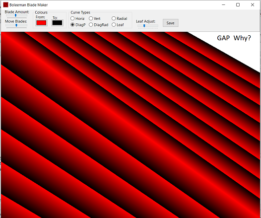

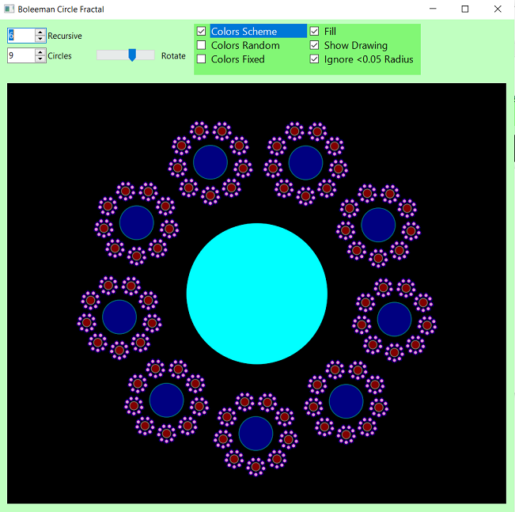

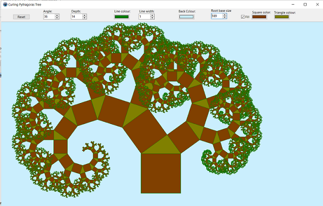

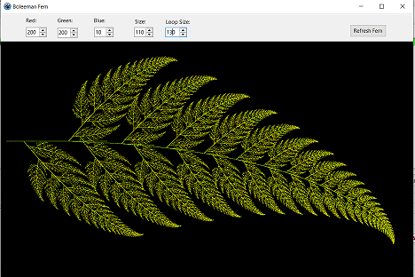

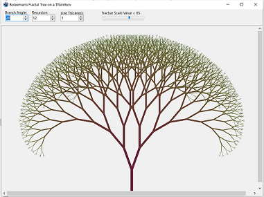

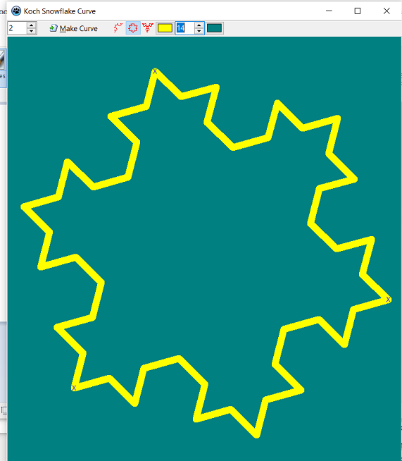

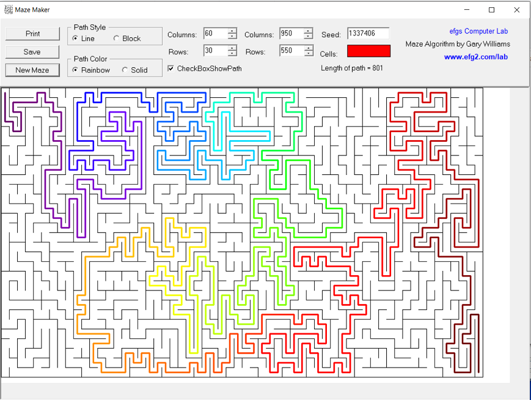

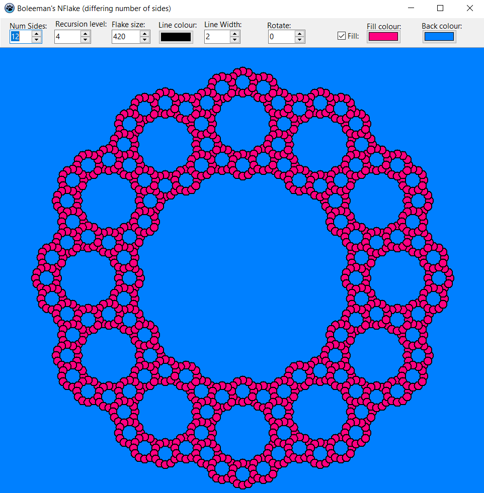

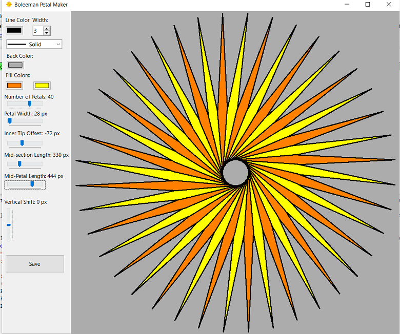

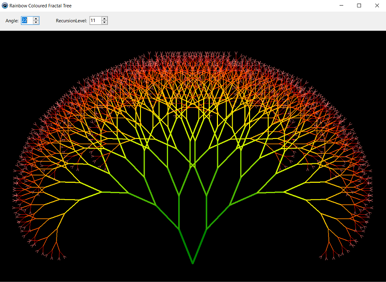

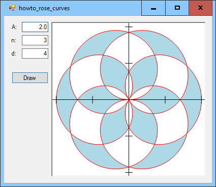

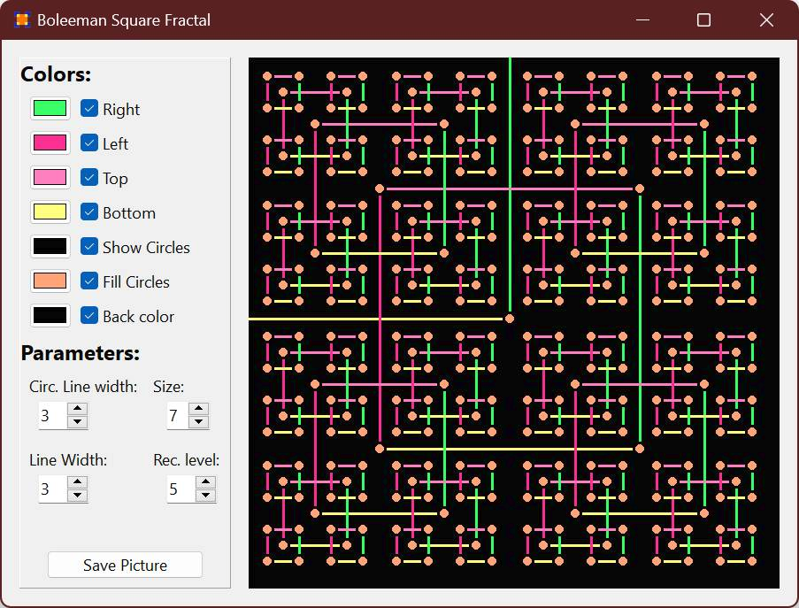

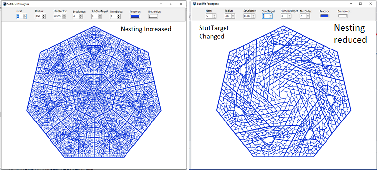

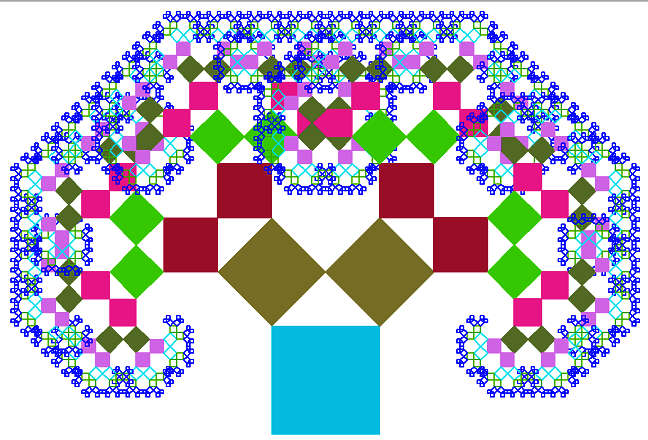

## Authors

* 
* with the help of: Dzandaa, KodeZwerg, Josh, WP, Jamie, TRon, Circular, Lainz and everyone else.

## License

"Has a free licence".
