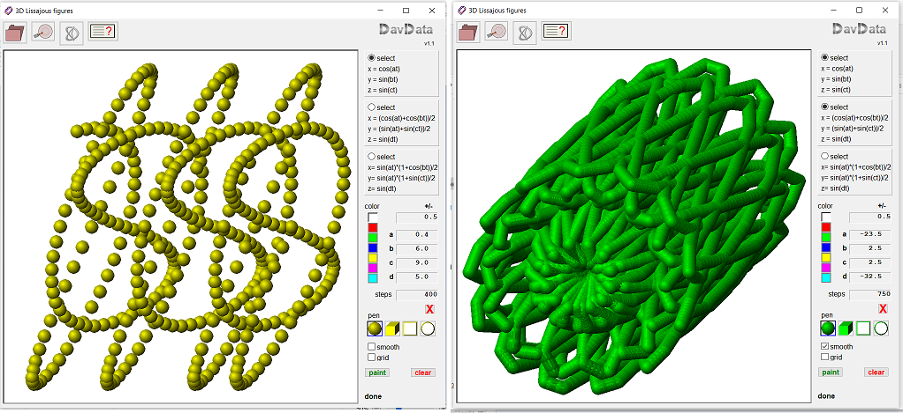
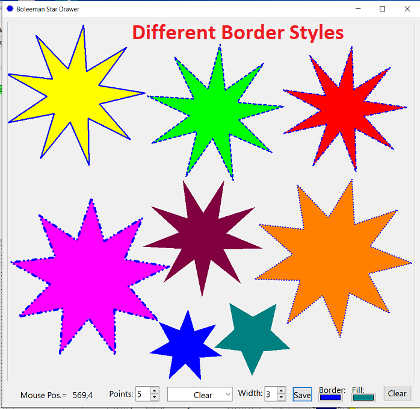
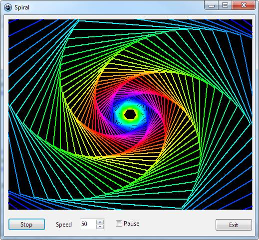

All these projects (and their screenshots) were originally published on [Lazarus forum, 'Graphics' part](https://forum.lazarus.freepascal.org/index.php/board,39.0.html).

## Gallery

## Authors

* [Boleeman](https://forum.lazarus.freepascal.org/index.php?action=profile;u=70476)
* with the help of: Dzandaa, KodeZwerg, Josh, WP, Jamie, TRon, Circular, Lainz and everyone else

## License

"Has a free license".
